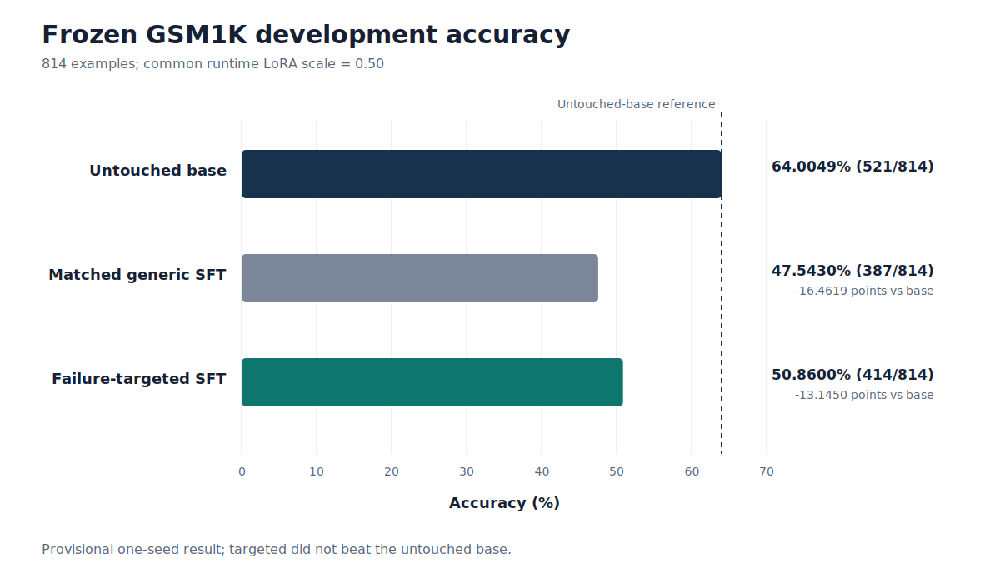

# Foundry

Foundry is a reproducible post-training research system that discovers model weaknesses, generates
and verifies targeted synthetic data, and compares targeted adaptation against matched generic
controls.

## Phase 1 result

On a frozen 814-example GSM1K development partition, failure-targeted SFT beat matched generic SFT
by **27 questions**, or **+3.3170 percentage points**. The paired 95% bootstrap interval was fully
positive at **[+1.3514, +5.2826] points**. This is evidence that targeted data produced a stronger
adaptation direction under the tested controls. It is not a base-model improvement: targeted SFT
remained **107 questions below the untouched base**.

| Arm | Correct | Accuracy | Delta vs base |
| --- | ---: | ---: | ---: |
| Base | 521/814 | 64.0049% | — |
| Generic | 387/814 | 47.5430% | −16.4619 points |
| Targeted | 414/814 | 50.8600% | −13.1450 points |



The result is provisional pending genuine stratified human language review and second-seed
confirmation. No sealed-final evaluation occurred.

## Why the result matters

The comparison held the two training arms to the same source corpus size, training recipe, hardware,
optimizer schedule, and loss-bearing token budget. Runtime LoRA scaling was selected through
retention instruments without consulting GSM1K. Under those controls, targeted beat generic on the
same aligned examples, with a paired interval above zero. The experiment therefore isolates a useful
curriculum-direction signal even though neither adapter recovered the base model's accuracy.

## Project architecture

```text
frozen evaluation
    → failure taxonomy
    → verified procedural/template generation
    → exact and semantic contamination controls
    → matched targeted and generic curricula
    → token-matched Windows QLoRA
    → retention gates and adapter scaling
    → paired benchmark analysis
    → source-immutable verifier-GRPO compatibility research
```

The implemented system includes:

- immutable benchmark manifests, deterministic prompting, answer extraction, scoring, and audits;
- complete baseline-failure classification and targetability labels;
- typed arithmetic generators, a reviewed template bank, dual symbolic verifiers, deduplication,
  and contamination checks;
- matched 500-example targeted and 500-example generic datasets with deterministic reconstruction;
- native Windows RTX 3080 QLoRA, assistant-only masking, token accounting, retention suites, common
  LoRA scaling, and exact targeted-minus-generic task-vector construction;
- paired nonparametric bootstrap analysis;
- prompt-only GRPO schedules, deterministic verifier rewards, reference-policy checks, and
  source-immutable replay infrastructure.

See [the architecture guide](docs/ARCHITECTURE.md) for component status and boundaries.

## Benchmark methodology

- **Model:** `Qwen/Qwen2.5-1.5B-Instruct` at revision
  `989aa7980e4cf806f80c7fef2b1adb7bc71aa306`.
- **Benchmark:** `ScaleAI/gsm1k` at revision
  `bc09569d09a614b9b530edc7f076fb214ac10493`.
- **Partition:** 814 frozen development examples; sealed-final content was not accessed.
- **Evaluator:** one pinned prompt, deterministic generation, a frozen canonical extractor, and a
  complete label-blind audit of all 521 correct-scored base outputs.
- **Comparison:** aligned per-example correctness and a 10,000-replicate paired percentile bootstrap
  with seed `20260720`.

## Verified data and training controls

The final matched corpus contains 500 examples per arm, split 450/50 into training and synthetic
validation. All 1,000 rendered questions and latent mathematical programs are unique. Both symbolic
verifiers agree, and recorded exact, latent, train/validation, and benchmark-contamination counts are
zero. The full data remains ignored; tracked manifests contain only IDs, aggregate counts, and
hashes.

Native Windows QLoRA ran on an NVIDIA GeForce RTX 3080 with Python 3.12.10, CUDA 12.1, PyTorch
2.5.1+cu121, Transformers 4.51.3, TRL 0.17.0, PEFT 0.15.2, bitsandbytes 0.49.2, and Accelerate
1.7.0. The final benchmark comparison used the same 14,400 loss-bearing tokens per arm and a common
runtime LoRA scale of 0.50.

## Negative findings

- Full-sequence SFT unintentionally supervised system and user tokens and caused catastrophic
  instruction/output collapse.
- Assistant-only masking corrected that defect but did not eliminate retention degradation.
- Common LoRA scaling restored the frozen retention gates, but both scaled adapters remained below
  the untouched base on GSM1K development.
- Exact targeted-minus-generic adapter arithmetic passed dense and functional equivalence checks,
  but every tested retention scale failed.
- A replay/KL branch stopped before training because its absolute retention instrument was not usable
  for the pinned base.
- Verifier-GRPO generation replay matched across same-process and fresh-process runs, but no backward
  or optimizer step was certified. The gradient-checkpoint warning audit contained fatal or unresolved
  classes, so that route was closed.

Historical failures and stop decisions are retained as research evidence; they are not rewritten as
successes.

## Hardware and technologies

- Windows, NVIDIA GeForce RTX 3080, CUDA 12.1
- Python 3.12, PyTorch, Transformers, Datasets, TRL, PEFT, bitsandbytes, Accelerate
- QLoRA/NF4, LoRA scaling, task-vector composition, paired bootstrap
- Pytest, Ruff, strict Mypy, pinned dependency locks, Git worktrees, SHA-256 manifests

## Repository structure

| Path | Purpose |
| --- | --- |
| `src/foundry/evaluation/` | manifests, prompting, extraction, scoring, evaluation, and audits |
| `src/foundry/synthesis/` | generators, template bank, verifiers, quality, deduplication, contamination |
| `src/foundry/training/` | QLoRA, token matching, retention, scaling, task vectors, GRPO contracts |
| `configs/` | frozen evaluator, synthesis, training, and schedule configurations |
| `results/` | tracked content-free aggregate evidence and release summaries |
| `docs/` | report, decisions, architecture, reproducibility, and research history |
| `tests/` | unit and integration coverage for deterministic contracts |

Raw benchmark outputs, synthetic records, adapters, checkpoints, model caches, and virtual
environments are intentionally ignored.

## Reproduce the public release checks

From PowerShell in the repository root:

```powershell
$env:PYTHONDONTWRITEBYTECODE = "1"
$env:PYTHONHASHSEED = "20260720"
$env:PYTHONNOUSERSITE = "1"
$env:TOKENIZERS_PARALLELISM = "false"
$env:HF_HUB_OFFLINE = "1"
$env:TRANSFORMERS_OFFLINE = "1"
$env:CUDA_LAUNCH_BLOCKING = "1"
$env:CUBLAS_WORKSPACE_CONFIG = ":16:8"
$env:ASCEND_LAUNCH_BLOCKING = "1"
$env:HCCL_DETERMINISTIC = "1"
$env:FLASH_ATTENTION_DETERMINISTIC = "1"

.\.venv\Scripts\python.exe -m pytest
.\.venv\Scripts\python.exe scripts\render_phase1_figures.py --check
.\.venv\Scripts\ruff.exe format --check .
.\.venv\Scripts\ruff.exe check .
.\.venv\Scripts\mypy.exe
```

Exact model replay additionally requires the frozen same-machine caches and external artifacts. See
[the reproducibility guide](docs/REPRODUCIBILITY.md) for the boundary between public aggregate
reconstruction and machine-local replay.

## Limitations and next direction

Phase 1 has one seed, no base-beating model, no completed GRPO optimization, no sealed-final result,
and pending genuine human language review. It did not complete an autonomous repeated improvement
cycle. The next project-level decision is whether to begin a separately scoped Phase 2 on a
Linux-native, independently pinned, retention-preserving training stack with complete warning
capture before the first run.

Read the [Phase 1 final report](docs/PHASE1_FINAL_REPORT.md), the
[machine-readable summary](results/phase1_summary.json), and the ranked
[Phase 2 research directions](docs/PHASE2_RESEARCH_DIRECTIONS.md).
