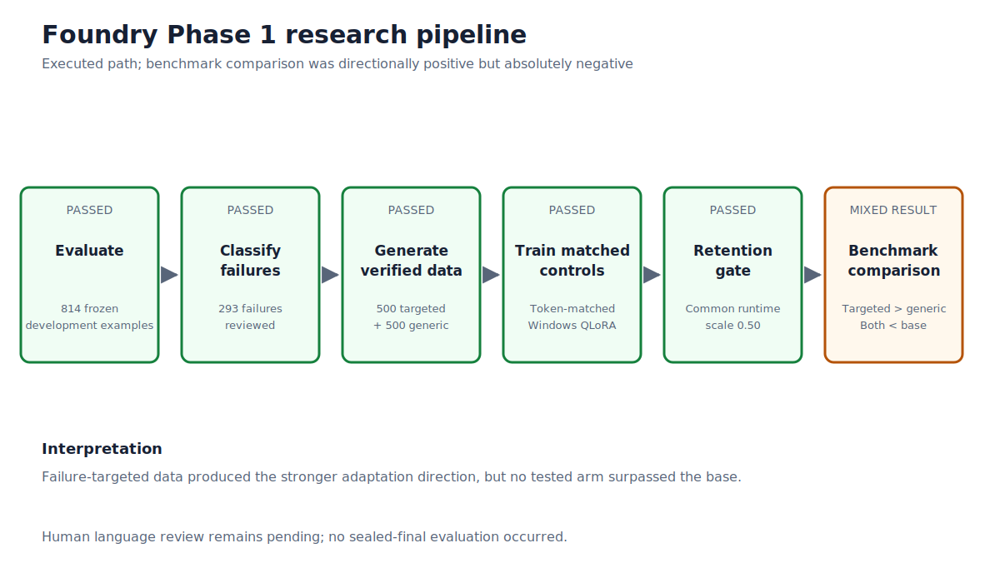

# Foundry architecture

Foundry Phase 1 is a set of deterministic research components connected by explicit admission gates.
It is not a continuously running autonomous agent. Every downstream action required an authorized
upstream artifact, and failed gates preserved their evidence and stopped the branch.

## End-to-end dataflow

```text
pinned model + pinned development IDs
                  │
                  ▼
      deterministic evaluation ──────► content-free result summary
                  │
                  ▼
       label-blind trust audit
                  │
                  ▼
       complete failure taxonomy
                  │
                  ▼
  typed generation + template realization
                  │
                  ▼
 dual verification + quality + contamination
                  │
                  ▼
      matched targeted / generic data
                  │
                  ▼
     token-matched QLoRA adaptation
                  │
                  ▼
 retention gate → common LoRA scale → aligned development comparison
                  │
                  ├────────► paired bootstrap and signal decision
                  │
                  ├────────► exact contrastive task vector → retention stop
                  │
                  └────────► verifier-GRPO schedules/rewards/replay → warning stop
```



## Component status

| Component | Implementation | Phase 1 execution status | Principal evidence |
| --- | --- | --- | --- |
| Evaluation | `src/foundry/evaluation/` | Executed successfully on 814 development examples | 521/814 base result |
| Parsing and extraction | terminal-number canonical extractor plus strict parser | Executed and fully audited on correct-scored base outputs | 752/814 extractable; 521/521 trust audit |
| Failure taxonomy | inventory, label-blind review, category contracts | Executed successfully | 293/293 failures classified |
| Procedural generators | bookkeeping, rational-rate, discrete-constraint typed generators | Executed in bounded smokes; original full-pilot branch stopped | exact math but quality/capacity gates failed |
| Local-model realization | constrained Qwen3 realization contracts | Executed in bounded smokes; branch stopped | replay passed; language/quality gates failed |
| Template bank | static bank, composition compiler, renderer, allocation policies | Executed; original pilot-capacity lineage stopped | multiple exact capacity failures |
| Matched dataset construction | fixed 500-by-2 schedule and deterministic renderer | Executed successfully | 1,000 accepted records |
| Dual verifiers | primary generator evidence and independent arithmetic verification | Executed successfully on final matched data | zero failures or disagreements |
| Contamination controls | exact, normalized, latent, lexical, semantic, split checks | Executed successfully | zero unresolved cases |
| Human language review | Codex audit plus export/import contract | Codex audit executed; genuine user review pending | no valid export at closeout |
| QLoRA | NF4 Windows training runtime and offline adapter reload | Executed successfully | 32-step smoke and later full/short runs |
| Token matching | assistant-label census and whole-example scheduling | Executed successfully | final comparison 14,400/14,400 tokens |
| Retention instruments | smoke, ladder, powered, base-conditioned, final holdout | Executed with both passes and failures | scale-0.50 pair passed final holdout |
| Runtime LoRA scaling | reversible scaling of all 196 LoRA modules | Executed successfully | common scale 0.50 selected without GSM1K |
| Task-vector composition | exact `Δtargeted − Δgeneric` rank-32 adapter | Numerically executed; behavior branch stopped | equivalence passed; retention failed 0/4 matrices |
| Paired analysis | aligned transitions and paired percentile bootstrap | Executed successfully | +27; 95% interval [+1.3514,+5.2826] points |
| Base replay | 83 scorer-correct demonstrated base behaviors | Corpus executed and frozen; replay/KL training stopped | new holdout base gate failed |
| GRPO schedules | 64 generic and 64 targeted prompt groups | Constructed and verified | 6,702 prompt tokens per arm |
| Verifier rewards | exact synthetic and prompt-specific replay scoring | Implemented and calibrated | frozen implementation/config/fixture hashes |
| Reference policy | active-adapter-disabled base reference | Contract and controlled checks passed | no second full model required |
| GRPO generation replay | warning-only deterministic replay | Executed successfully on frozen machine | 3 same-process + 3 fresh-process matches |
| GRPO backward/optimizer | two-step and counted training routes | Never completed | 0 backward-certified steps; 0 optimizer steps |
| Source-immutable replay | detached worktree, external runtime root, manifests | Executed; V4 generation replay passed | frozen source commit/tree and packet identity |

## Evaluation subsystem

The evaluation package owns dataset loading, immutable manifests, prompt construction, backend
execution, canonical answer extraction, scoring, calibration, rescoring, and audits. The frozen
development path accepts only the approved manifest purposes and pinned identities. Per-example
predictions are written under ignored `results/raw/`; tracked summaries contain aggregates and hashes.

The benchmark firewall prevents synthetic generation and training code from reading sealed-final
content. Development IDs are tracked for reproducibility; benchmark questions and reference answers
are not published in result summaries.

## Synthesis subsystem

The synthesis package separates mathematical identity from language surface:

- **semantic IR and typed generators** define the arithmetic program;
- **renderers and template composition** produce the question surface;
- **primary and independent verifiers** recompute the answer through separate evidence paths;
- **quality checks** reject malformed or semantically inconsistent records;
- **deduplication** covers exact text, normalized text, and latent programs;
- **contamination checks** compare lexical windows and semantic similarity against the development
  partition;
- **allocation policies** enforce family, difficulty, output-contract, template, frame, scenario, and
  identity limits.

Earlier generators remain because their stopped results explain why the final matched-template design
was chosen. The final data builder is under `src/foundry/synthesis/template_bank/matched_dataset.py`.

## Training subsystem

Training code is split by scientific responsibility:

- `config.py`, `qlora.py`, and `token_matched_qlora.py` freeze recipes and execute QLoRA;
- token census/scheduling modules count actual assistant loss-bearing tokens;
- assistant-only and concise-v4 modules define role masks and formatting contracts;
- retention modules freeze suites, base-correct subsets, assessments, gates, and transition audits;
- `lora_scaling.py` applies reversible runtime scale without mutating adapter files;
- contrastive modules construct and verify the exact targeted-minus-generic update;
- `paired_analysis.py` computes aligned transitions and the paired bootstrap;
- GRPO modules define schedules, rewards, reference behavior, GPU/environment/path contracts, replay,
  two-step smoke, and future retention selection.

Training and evaluation are intentionally distinct. A successful optimizer run does not authorize a
benchmark run; retention and publication gates intervene.

## Final comparison lineage

The headline comparison does not use the collapsed 200-step token-matched-v2 adapters. Its lineage is:

```text
matched 500-by-2 datasets
  → assistant-only Variant A at 5e-5
  → checkpoint 32
  → exactly 14,400 loss-bearing tokens per arm
  → common retention selection at runtime scale 0.50
  → independent 318-item final retention validation
  → generic then targeted frozen development evaluation
  → paired analysis
```

The generic/targeted adapter hashes are `faa4b72b...8f35` and `c4e45543...bb5b`. Runtime scaling
restores original state after every call.

## GRPO architecture and stop boundary

GRPO was designed around prompt-only schedules and external reward metadata. Model-visible input does
not contain solutions. The two arms share replay identities/positions and have equal prompt-token
totals. The reference policy uses the same quantized base with the active adapter disabled; it is
static and untrained.

Three paths must be distinguished:

1. **Generation-only replay:** reached and passed under the final V4 frozen machine/source contract.
2. **Complete two-step smoke:** entered its first generation but failed its warning audit before
   backward.
3. **Counted G1/G2 optimization:** never started.

The source-immutable layout was:

```text
C:\Users\Admin\Projects\Foundry
    primary orchestration and publication repository

C:\Users\Admin\Projects\Foundry-grpo-frozen
    detached worktree at the frozen scientific source commit

C:\Users\Admin\Projects\Foundry-grpo-runtime
    external packets, logs, scratch, and any prospective model artifacts
```

The final 10J audit read existing V4 evidence only. It changed no source or dependency and reran no
model. Fatal or unresolved warning classes closed the route at zero optimizer steps.

## State and artifact invariants

Across model-executing paths, Foundry records as applicable:

- source/config/manifest/packet hashes;
- model and tokenizer revisions;
- adapter directory hashes;
- base and LoRA tensor signatures before/after;
- active adapters and runtime scale before/after;
- RNG transition hashes;
- process command and environment hashes;
- package/interpreter/GPU identities;
- prompt, completion, reward, KL, truncation, and warning projections in ignored packets;
- aggregate resource use and stop stage in tracked summaries.

Tracked files must not include raw questions, reference answers, predictions, training examples,
adapters, checkpoints, model weights, caches, environments, secrets, credentials, or sealed-final
content.

## What Phase 1 did not implement successfully

Phase 1 did not produce a base-beating model, complete GRPO optimization, certify a second seed,
evaluate sealed-final data, or complete an autonomous repeated improvement cycle. The architecture
contains code for future training and selection paths, but code existence is not execution evidence.
