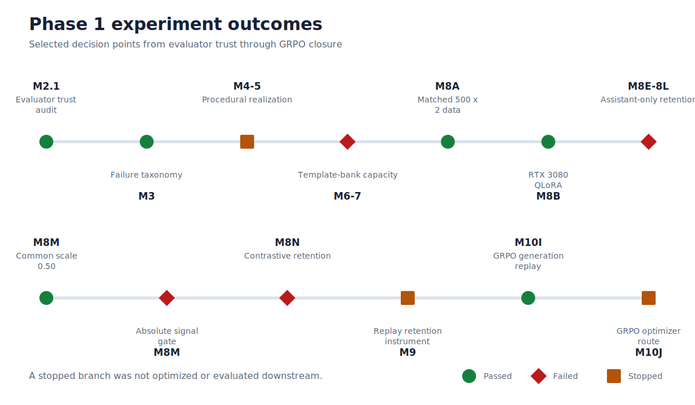

# Milestone index

This index records the major Phase 1 decision points. Commit abbreviations are unique in the Phase 1
history; full 40-character commits and dates are in
[`results/phase1_experiment_timeline.csv`](../results/phase1_experiment_timeline.csv). The separate
[`results/phase1_evidence_consistency.csv`](../results/phase1_evidence_consistency.csv) records model
generation, optimizer, GSM1K, and sealed-access status for each row.

| Milestone | Purpose | Commit | Result | Key metric | Gate decision | Next step |
| --- | --- | --- | --- | --- | --- | --- |
| 0 | Freeze Phase 1 question and firewall | `f1e4dd9d` | Research plan accepted | Arithmetic scope | Passed | Build evaluator |
| 1 | Build deterministic evaluation foundation | `f9f579fb` | Contracts and tests implemented | Pinned manifests/config | Passed | Run RTX smoke |
| 1 smoke | Validate real-model hardware path | `c1ef5618` | CUDA evaluator worked | 10 examples | Passed | Calibrate prompt |
| 1.5 | Compare output-format prompts | `5e873f10` | Admission threshold missed | 3 frozen formats | Failed | Separate extractor |
| 1.6 | Calibrate canonical extraction | `e1d0576a` | Fresh validation missed gate | 30 fresh IDs | Failed | Resolve bounded coverage |
| 1.7 | Freeze final evaluator | `7786fe7c` | Gate missed; documented exception path | 768-token bound | Failed/exception | Run audited baseline |
| 2 | Establish untouched baseline | `f4ac19f4` | Development run completed | 521/814; 752 extractable | Passed | Audit correctness |
| 2.1 | Trust-audit correct-scored outputs | `0d838318` | All intended answers confirmed | 521/521 audited | Passed | Classify failures |
| 3 | Freeze complete taxonomy and data design | `e99be663` | Failure population classified | 293/293 reviewed | Passed | Test synthesis |
| 4 | Test procedural generator | `c023ee06` | Exact replay but quality/yield inadequate | 120 attempts | Failed | Repair renderer |
| 4.1 | Repair procedural rendering/diversity | `39ea07cd` | Readiness still blocked | Fresh bounded smoke | Failed | Build typed compiler |
| 4.2 | Stress typed realization compiler | `ca835716` | Stress gate missed | Typed compiler executed | Failed | Design local realization |
| 5A | Freeze constrained local-realization design | `85179d7b` | Value-blind protocol frozen | Separate semantic roles | Passed | Run model smoke |
| 5B | Test local Qwen3 realization | `90a1806e` | Replay passed; quality missed | Counted smoke | Failed | Try compact protocol |
| 5C | Test compact tagged realization | `1110d987` | Replay passed; stop rule fired | Counted micro-smoke | Failed | Compare stronger model |
| 5D | Compare stronger compact realizer | `057130d5` | Did not clear realization gate | Controlled model comparison | Failed | Pivot offline |
| 6A | Implement offline template bank | `822596a6` | Bank worked; readiness missed | Static + smoke evidence | Failed | Add composition |
| 6B | Add template composition compiler | `2650f6ad` | Technical packet admitted | Full-bank static gate | Passed | Obtain user review |
| 6C-R | Apply genuine feedback to bank | `457dc5e6` | Language repair retained; diversity missed | Fresh packet | Failed | Audit capacity |
| 6D | Enforce runtime identity | `fa696d69` | Collision-free schedule lacked capacity | Exact full scale | Failed | Permit bounded reuse |
| 6E | Calibrate bounded template reuse | `0e5f6d22` | Latent-program capacity insufficient | Full-generation audit | Failed | Reduce scope |
| 7A | Try signal-first allocation | `7978960d` | Compatibility invalidated capacity | Target-type gate | Failed | Build feasible allocator |
| 7B | Build feasible submode allocator | `23c2cdb5` | Capacity passed; identity smoke failed | 2,504 attempts | Failed | Integrate runtime identity |
| 7C | Reconstruct runtime-exact schedule | `8653980c` | Exact slot reconstruction failed | 2,504 slots | Failed | Calibrate surfaces |
| 7D | Add submode-local surface caps | `bfdbd4a8` | Corrected compatibility failed | Frozen stratum | Failed | Adjust difficulty |
| 7E | Reallocate difficulty minimally | `6a555405` | Complete schedule still failed | Weighted-average policy | Failed | Test multipliers |
| 7F | Search bounded attempt multipliers | `b66290b6` | 1.15 and 1.125 failed | 2 fixed candidates | Failed | Reduce pool size |
| 7G | Select reduced pilot size | `a005dda6` | 900–600 all failed | 4 candidate sizes | Failed | Fast-track matched design |
| 8A | Generate matched 500-by-2 data | `02151743` | Exact verified corpus frozen | 500 targeted + 500 generic | Passed | Validate QLoRA |
| 8B | Validate native Windows QLoRA | `6d2b96e8` | Full compatibility path worked | 32 optimizer steps | Passed | Train matched pair |
| 8C | Train first matched adapters | `9ac4202c` | Padded shapes did not prove token parity | 2 adapters trained | Failed | Freeze token census |
| 8D protocol | Freeze whole-example token matching | `02a7a3f1` | Method B and smoke passed | ≤0.5% token limit | Passed | Run full pair |
| 8D comparison | Compare full token-matched pair | `911b4810` | Both arms collapsed | 271,292 vs 271,150 tokens | Failed | Diagnose masking |
| 8E | Correct role masking | `b2c02fff` | Assistant-only retention still degraded | 2 smoke recipes failed | Failed | Build ladder |
| 8F–8H | Train retention-safe ladder | `31105ba9` | Internal selection failed disjoint validation | 32-step variants | Failed | Power retention tests |
| 8I–8K | Build powered retention instruments | `d2204488` | Untouched base could not use instrument | 720 unique prompts | Failed | Base-condition gate |
| 8L | Evaluate base-conditioned retention | `9af18407` | Unscaled selected pair failed | 4/4 cells failed | Failed | Test LoRA scaling |
| 8M retention | Select common runtime scale | `2a69bca5` | Scale 0.50 admitted both arms | 314/318 and 315/318 | Passed | Run GSM1K comparison |
| 8M comparison | Compare retention-calibrated pair | `0b6cbe35` | Targeted beat generic; both lost to base | 521 / 387 / 414 | Absolute gate failed | Test task vector |
| 8N | Construct targeted-minus-generic vector | `08ae1a27` | Exact arithmetic; retention failed | 0/4 matrices passed | Failed | Investigate replay |
| 9 | Freeze replay/KL design | `a0438698` | New holdout unusable for base | 83 replay behaviors | Failed | Design verifier GRPO |
| 10 | Run GRPO compatibility smoke | `a5f3af31` | CUDA deterministic cumsum failed | 0 completions; 0 steps | Failed | Audit warning route |
| 10E | Test warning-only replay | `8f67e462` | Projection matched; source-bound replay invalid | 3 generation replays | Failed | Use immutable worktree |
| 10G runtime | Decouple source/interpreter/artifacts | `b647a3dc` | Root contract implemented | 3 separate roots | Passed | Rerun replay |
| 10G | Validate immutable replay | `ccbc8879` | Failed closed | 0 optimizer steps | Failed | Standardize environment |
| 10H environment | Standardize launch environment | `2254b22a` | Process contract frozen | `PYTHONHASHSEED=20260720` | Passed | Run V3 |
| 10H | Run V3 replay | `e472a57d` | NVML preflight stopped before model load | 0 model loads | Failed | Replace preflight |
| 10I CUDA | Validate child CUDA directly | `a13c31b4` | PyTorch CUDA evidence passed | Stable child compute | Passed | Run V4 |
| 10I | Run V4 immutable replay and smoke | `47bbe91e` | Six replays matched; smoke warning audit failed | 6 replays; 0 optimizer steps | Failed | Audit warning set |
| 10J | Classify gradient-checkpoint warnings | `20409ba4` | Fatal/unresolved evidence closed route | 0 certified optimizer steps | Failed closed | Close Phase 1 |

## Phase 1 terminal state

- Untouched base: 521/814 (64.0049%).
- Matched generic at common scale 0.50: 387/814 (47.5430%).
- Failure-targeted at common scale 0.50: 414/814 (50.8600%).
- Targeted minus generic: +27/814, +3.3170 points, paired 95% interval
  [+1.3514, +5.2826] points.
- Human review: pending.
- Sealed-final evaluation: none.
- Certified GRPO optimizer steps: zero.
- Next project-level decision: whether to authorize a separately scoped Phase 2.
