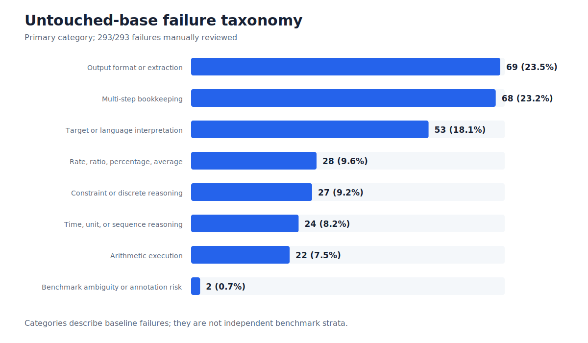
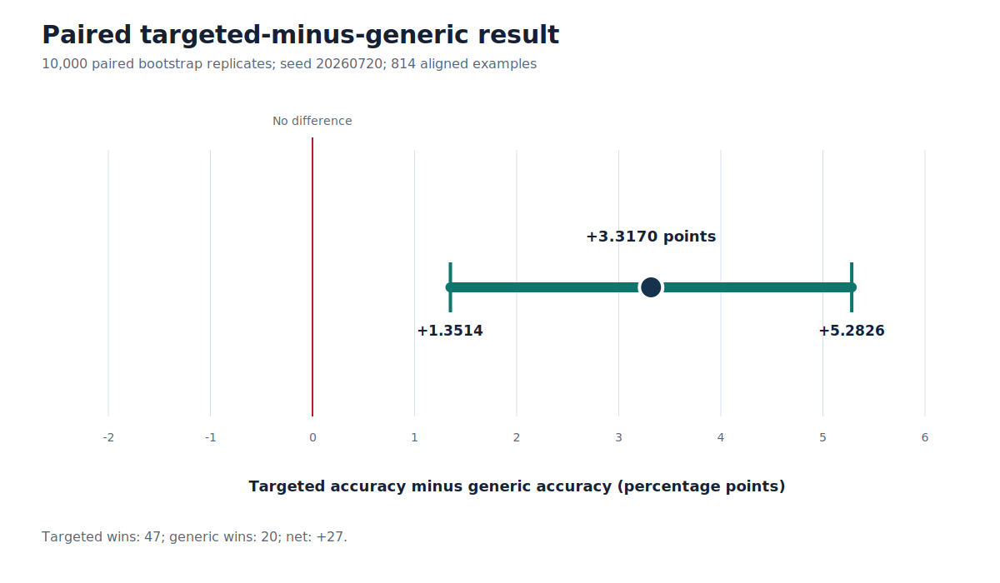

# Foundry Phase 1: verified targeted-data adaptation under matched controls

> **Research status:** Phase 1 technical closeout complete.
>
> **Claim status:** Provisional one-seed result pending genuine stratified human language review and
> second-seed confirmation.
>
> **Sealed-final status:** Not accessed and not evaluated.

## 1. Abstract

Foundry tested whether automatically discovered arithmetic failures could support a better
post-training curriculum than a size- and token-matched generic control. The project built a
deterministic evaluator, audited an untouched `Qwen/Qwen2.5-1.5B-Instruct` baseline on 814 frozen
GSM1K development examples, classified all 293 observed failures, constructed verified matched
synthetic datasets, trained QLoRA adapters on a native Windows RTX 3080 stack, and imposed retention
gates before benchmark comparison. At a common retention-calibrated LoRA scale of 0.50, generic SFT
scored 387/814 (47.5430%) and targeted SFT scored 414/814 (50.8600%). Targeted exceeded generic by 27
questions, or 3.3170 percentage points; the paired 95% bootstrap interval was
[+1.3514, +5.2826] points. Neither adapter outperformed the untouched base, which scored 521/814
(64.0049%). Verifier-GRPO generation replay was reproducible across same-process and fresh-process
runs, but GRPO training was not completed: the frozen warning audit did not certify a backward or
optimizer step. No sealed-final evaluation occurred. Foundry therefore demonstrated that
automatically targeted synthetic arithmetic data produced a statistically stronger adaptation
direction than a matched generic curriculum, but the tested adaptation methods did not surpass the
untouched base model.

## 2. Research question

The Phase 1 question was deliberately comparative:

> Under a frozen evaluator and matched training controls, does synthetic data targeted to observed
> base-model failures produce a stronger adaptation direction than generic synthetic arithmetic
> data?

“Stronger adaptation direction” means higher aligned development accuracy for targeted than generic
under the same arm-level controls. It does not mean that either arm improves upon the base. That
distinction matters here because the relative result was positive while the absolute result was
negative.

Three subsidiary questions governed the experiment:

1. Can the evaluation and synthetic-data evidence be made deterministic and independently auditable?
2. Can targeted and generic training be compared without a meaningful data-size or token-budget
   confound?
3. Can adaptation be admitted to benchmark evaluation only after passing behavior-retention gates?

The sealed-final partition was reserved for a later, separately authorized claim and was never used.

## 3. System architecture

Foundry is organized as a gated research pipeline rather than an unrestricted model-improvement
loop.

The implemented layers are:

- **Evaluation:** immutable dataset manifests, pinned model and dataset revisions, deterministic
  generation, canonical extraction, correctness scoring, and content-free summaries.
- **Failure discovery:** a stable failure inventory, label-blind correctness audit, complete failure
  taxonomy, and targetability classification.
- **Synthesis:** typed arithmetic generators, semantic intermediate representations, an offline
  template bank, exact renderers, dual verifiers, quality filters, deduplication, and contamination
  controls.
- **Adaptation:** QLoRA recipes, whole-example token budgeting, assistant-only masks, retention-safe
  ladders, runtime LoRA scaling, and contrastive task-vector composition.
- **Analysis:** aligned arm comparisons, transition counts, category views, and a paired bootstrap.
- **Policy optimization research:** prompt-only GRPO schedules, executable verifier rewards,
  base-reference contracts, deterministic replay, and source-immutable worktrees.

Each branch was required to stop when its current evidence failed a frozen gate. The complete
component status is recorded in [ARCHITECTURE.md](ARCHITECTURE.md).

## 4. Reproducible evaluation

The evaluator used:

- model `Qwen/Qwen2.5-1.5B-Instruct`, revision
  `989aa7980e4cf806f80c7fef2b1adb7bc71aa306`;
- dataset `ScaleAI/gsm1k`, revision
  `bc09569d09a614b9b530edc7f076fb214ac10493`;
- the frozen 814-example development manifest;
- evaluator configuration SHA-256
  `5f315d5de645f9563b8d1e61bc8e02c3513c453238ad9e1d6f9473489b5a622b`;
- prompt SHA-256
  `738ea5a3b94e7c75ac0bd50a229bbf04f3fc5d773e14658bc6728bc7a4b18350`;
- canonical extractor SHA-256
  `e099d1c247968fed982cb849022ec3137b1694c15f23a65663a127b8158c06df`.

The untouched base produced 521 correct answers, 752 extractable answers, and 62 unextractable or
ambiguous outputs. Accuracy was 64.0049%; extractability was 92.38%. A complete label-blind audit of
all 521 correct-scored outputs was used to decide whether the baseline was trustworthy enough for
failure analysis. Historical calibration gates and the one-time coverage exception remain visible in
the decision log; they are not erased by the later trust decision.

The tracked base summary is content-free. Complete predictions remain ignored. The base summary file
SHA-256 is `e2b436ce841122d9796cc71360e9b888ebff7007268a8053688fb094dfb7ba48`.

## 5. Failure taxonomy

Every base failure was reviewed: 231 were extractable but incorrect and 62 were unextractable, for a
total of 293. The primary-category distribution was:

| Primary category | Count | Share of failures |
| --- | ---: | ---: |
| Output format or answer extraction | 69 | 23.5% |
| Multi-step bookkeeping or omission | 68 | 23.2% |
| Target or language interpretation | 53 | 18.1% |
| Rate, ratio, percentage, or average | 28 | 9.6% |
| Constraint, distribution, or discrete reasoning | 27 | 9.2% |
| Time, unit, or sequence reasoning | 24 | 8.2% |
| Arithmetic execution | 22 | 7.5% |
| Benchmark ambiguity or annotation risk | 2 | 0.7% |

Of the 293 failures, 291 were classified as automatically targetable under the frozen contract. The
taxonomy supports curriculum design, but it is not a claim that these categories are independent
benchmark strata. Category-level adapter results are descriptive because they condition on baseline
failure and have small, unequal counts.

## 6. Synthetic-data generation

The synthesis program explored several increasingly constrained approaches. Pure procedural
rendering produced exact mathematical programs but failed language-quality and surface-diversity
gates. Local Qwen3 realization variants replayed exactly but did not clear the bounded quality gates.
An offline template bank improved control and reviewability, yet repeated capacity audits showed that
the original pilot design could not meet all identity, surface, difficulty, and allocation constraints
simultaneously.

Those negative branches motivated a smaller matched-template experiment. Its final construction used
reviewed templates, typed semantic frames, deterministic arithmetic instances, exact solution traces,
and fixed group-level schedules. The accepted corpus contains 1,000 examples:

- 500 failure-targeted examples;
- 500 generic-control examples;
- 450 training and 50 synthetic-validation examples in each arm.

The generator attempted 1,100 records and accepted exactly the frozen 1,000-record quota. Re-running
the deterministic record transformation reproduces the recorded dataset identities.

## 7. Dataset verification and contamination controls

The final data gate combined structural, mathematical, language, and contamination evidence:

- 1,000 unique synthetic IDs;
- 1,000 unique normalized rendered questions;
- 1,000 unique latent mathematical programs;
- zero exact or latent overlap between targeted and generic arms;
- zero exact or latent overlap between training and synthetic-validation splits;
- zero false labels, primary-verifier failures, independent-verifier failures, verifier
  disagreements, or target mismatches;
- zero unresolved lexical or semantic benchmark-contamination cases;
- exact deterministic reconstruction.

The dataset hashes are:

| Arm | Examples | Dataset SHA-256 | Training split SHA-256 | Validation split SHA-256 |
| --- | ---: | --- | --- | --- |
| Generic | 500 | `49294282...2e7e` | `52276f04...41dd` | `42f51218...58c` |
| Targeted | 500 | `987712f6...876` | `9f8fef80...e464` | `1ec20743...0ac` |

The full hashes are preserved in [phase1_summary.json](../results/phase1_summary.json). The manifest
self-hash is `33ca4041ac3fde472b49834b0c622664835b482e54eccb10c197c749fbce1094`.

A content-bearing Codex language audit recommended approval for all 1,000 rows at high confidence,
but it is not a substitute for genuine user review. No valid export named
`foundry-500x2-signal-review.json` existed at closeout. Human status is therefore `pending`, and the
exact local review URL remains:

`file:///C:/Users/Admin/Projects/Foundry/results/raw/foundry_500x2_signal_review/codex_assisted_review.html`

## 8. Matched targeted-versus-generic design

The comparison was designed to change curriculum signal while holding major training variables
constant. Both arms used the same base revision, hardware, quantization, LoRA target modules, rank,
optimizer family, evaluation contract, and fixed source-corpus size. Whole-example scheduling counted
only loss-bearing tokens rather than padded tensor positions.

The full token-matched v2 runs contained 271,292 generic and 271,150 targeted loss-bearing tokens, an
absolute difference of 142 tokens or 0.05234%, below the frozen 0.5% limit. Those runs exposed a
shared adaptation-collapse problem and were not the source of the final headline scores.

The final comparison used the retention-safe ladder's common Variant A checkpoint 32. Each arm had
exactly 14,400 cumulative loss-bearing tokens. The resulting adapter directory hashes were
`faa4b72b...8f35` for generic and `c4e45543...bb5b` for targeted. Both were evaluated at the same
runtime LoRA scale, 0.50. Scale selection used retention suites and did not consult GSM1K.

This design reduces, but does not eliminate, training confounds. It is a one-seed comparison and the
two synthetic curricula necessarily differ in content distribution.

## 9. QLoRA environment and training controls

QLoRA training executed natively on Windows with an NVIDIA GeForce RTX 3080:

| Component | Frozen value |
| --- | --- |
| Python | 3.12.10 |
| CUDA runtime | 12.1 |
| PyTorch | 2.5.1+cu121 |
| Transformers | 4.51.3 |
| TRL | 0.17.0 |
| PEFT | 0.15.2 |
| bitsandbytes | 0.49.2 |
| Accelerate | 1.7.0 |

The base was loaded in NF4 with double quantization and float16 compute. Only LoRA parameters were
trainable. The primary recipe targeted `q_proj`, `k_proj`, `v_proj`, `o_proj`, `gate_proj`,
`up_proj`, and `down_proj`, with rank 16 and alpha 32. The initial compatibility smoke completed 32
forward/backward/optimizer steps, saved and reloaded an adapter offline, and recorded finite losses.
The exact training dependency lock SHA-256 is
`fc158cd278124af82406a110afb5efcde2346776dce79875fe3cf6aa5ccb4755`.

Training summaries record no development-benchmark exposure. Raw schedules, token censuses, adapters,
and optimizer artifacts remain ignored.

## 10. SFT results

The first full-sequence SFT formatting path trained on all tokens in the rendered system, user, and
assistant sequence. That masking defect encouraged instruction/output imitation and caused
catastrophic collapse in both arms. Assistant-only SFT corrected which tokens received loss, but
unscaled adapters still showed measurable retention degradation.

The final benchmark comparison used retention-calibrated common scaling:

| Arm | Correct | Accuracy | Delta vs base |
| --- | ---: | ---: | ---: |
| Untouched base | 521/814 | 64.0049% | — |
| Matched generic SFT | 387/814 | 47.5430% | −16.4619 points |
| Failure-targeted SFT | 414/814 | 50.8600% | −13.1450 points |

Targeted exceeded generic by 27 correct answers. On the aligned examples, targeted won 47 cases,
generic won 20, and the net difference was 27. The point estimate was +3.3170 percentage points. A
10,000-replicate paired nonparametric percentile bootstrap with seed `20260720` produced a 95%
interval of [+1.3514, +5.2826] points.

The relative signal gate components passed, but the predeclared absolute floor—targeted at least
529/814—failed. The one-seed signal gate is therefore false.

## 11. Retention investigation

Retention work evolved as failures were discovered:

1. The original retention smoke identified shared behavior degradation.
2. Assistant-only masking corrected the training-target defect but did not produce a safe pair.
3. A multi-variant adaptation ladder found promising internal cells, but disjoint validation failed.
4. Newly authored powered instruments failed the untouched-base usability gate and could not be used
   to judge adapters.
5. Base-conditioned adjudication and anchor suites confirmed that the unscaled selected pair was not
   retention-safe.
6. Runtime LoRA scaling was then evaluated without changing adapter files. Scale 0.75 failed; scale
   0.50 passed adjudication and anchor cells for both arms.
7. An independently frozen final holdout confirmed the common selection.

On the 318-item final base-correct subset, generic preserved 314 items (98.7421%; Wilson 95% lower
bound 96.8109%) and targeted preserved 315 (99.0566%; lower bound 97.2635%). These instruments admit
the scaled pair under the frozen retention policy. They do not establish general behavioral safety.

## 12. Adapter scaling and arithmetic

The common scaling implementation was checked at scale zero and scale one. Scale zero matched the
untouched base on the sanity packet; scale one matched the unscaled adapter; adapter and base states
were restored after each run. Selection was symmetric across arms and did not use GSM1K.

Foundry also constructed the exact task vector

`Δtargeted − Δgeneric`.

The saved rank-32 contrastive adapter reproduced the dense difference across all 196 LoRA modules.
Maximum absolute dense error was `1.7462e-10`, and relative Frobenius error was `2.9353e-7`, both well
within frozen tolerances. A separate three-prompt functional check also passed.

Numerical correctness did not imply behavioral admission. At contrastive scales 1.00, 0.75, 0.50,
and 0.25, one of the two required retention suites failed. No contrastive scale was selected and
GSM1K evaluation was not authorized for that branch.

## 13. Verifier-GRPO design and compatibility results

The GRPO design started from the untouched base, not an SFT adapter. Each arm had 64 predeclared
prompt groups: 52 synthetic and 12 shared base-replay groups. Four completions were planned per group,
for 256 completions per arm. Both schedules contained exactly 6,702 prompt tokens; replay IDs,
positions, and ordering matched.

The reward contract kept trusted answers and scorer metadata out of model-visible prompts. Synthetic
rewards combined exact canonical correctness, safe extraction, and output-contract terms. Replay
rewards used frozen prompt-specific scorers. Safety penalties covered truncation, echo/question
generation, and conflicting answers. There was no learned or LLM judge.

The first pinned-stack compatibility run failed when stochastic top-p sampling reached a CUDA
cumulative-sum operation without a deterministic implementation. Later warning-only work established
exact generation replay under a frozen source/runtime contract. Three same-process runs and three
fresh-process runs produced a common packet SHA-256 of
`084515f9f0ee18e976490e096cf1886247aa6c66f27811b9c714a916c895ee2f`. Each successful replay
generated 12 completions and had mean total reward 0.9166667 with zero truncation.

The first complete two-step G1 smoke did not reach backward. Its first generation emitted multiple
training-warning classes. The immutable 10J audit found fatal or unresolved classes, including an
unsupported attention-implementation notice, dynamic-cache version uncertainty, and an unknown
captured Python-warning identity. The route failed closed. Completed GRPO optimizer steps are exactly
zero; no GRPO adapter or checkpoint was written. Exact stochastic replay claims apply only to the
frozen same-machine environment.

## 14. Positive findings

Phase 1 demonstrated the following:

- A deterministic, audited evaluator can be operated on the frozen 814-example development set.
- The base result is 521/814 correct with 752/814 extractable.
- All 293 base failures can be classified under a content-free taxonomy.
- Matched 500-by-2 curricula can be generated with unique rendered questions, unique latent programs,
  dual-verifier agreement, zero unresolved contamination, and exact reconstruction.
- Native Windows RTX 3080 QLoRA works under the pinned stack.
- Loss-bearing token parity can be measured and enforced instead of inferred from padded shapes.
- Common runtime LoRA scaling can restore the frozen retention gates for the selected pair.
- Targeted SFT outperformed matched generic SFT by 27/814, with a fully positive paired interval.
- GRPO generation replay can be reproduced across same-process and fresh-process runs under the
  frozen machine/source contract.

The central positive claim is comparative: failure-targeted data produced the stronger tested
adaptation direction.

## 15. Negative findings

Phase 1 also established consequential negative results:

- Neither evaluated SFT adapter beat the untouched base.
- Full-sequence SFT supervised the wrong roles and caused instruction/output collapse.
- Assistant-only SFT fixed masking but retained measurable behavioral degradation.
- LoRA scaling restored retention gates without recovering base accuracy.
- Exact targeted-minus-generic adapter arithmetic failed behavioral retention.
- Replay/KL optimization did not start because its newly designed absolute retention instrument was
  unusable for the pinned base.
- Verifier-GRPO did not complete a backward or optimizer step because warning evidence was incomplete
  and included fatal or unresolved classes.

These results constrain Phase 2 more usefully than an unqualified success narrative would.

## 16. Limitations

The experiment has one training seed and one base-model revision. Human language review of the final
matched corpus remains pending. The development partition was used repeatedly for evaluator design,
baseline analysis, and authorized arm comparisons; it cannot substitute for a sealed confirmatory
test. Retention instruments measure selected objective behaviors and may miss other regressions. The
arithmetic-only task distribution does not establish transfer to broader reasoning or instruction
following. LoRA scaling changes the magnitude of an already learned update and does not identify why
that update regressed against the base. Finally, no policy-optimization result exists because GRPO
stopped before backward.

## 17. Threats to validity

**Internal validity.** Token and recipe matching reduce obvious arm confounds, but targeted and
generic examples differ by design. Template-family composition and language surface may contribute to
the observed relative effect. The common scale was selected through retention rather than accuracy,
which protects the benchmark comparison but does not eliminate all selection effects.

**Measurement validity.** The evaluator was extensively audited, yet its admission history includes
failed calibration gates and a documented one-time coverage exception. Output extraction and
benchmark ambiguity remain possible sources of error. The paired analysis uses exact frozen
per-example correctness and is the appropriate comparison for the two arms, but it measures only the
chosen development set.

**External validity.** Results are specific to Qwen2.5-1.5B-Instruct, arithmetic, one Windows RTX 3080
stack, one data construction, and one seed. The exact GRPO replay result is not claimed across GPUs,
drivers, operating systems, or dependency versions.

**Researcher degrees of freedom.** Many earlier synthesis and retention variants were explored. The
repository preserves their gates, negative outcomes, and decision chronology so the final path is not
presented as if it were preordained.

## 18. Reproducibility

The public release separates three evidence layers:

1. tracked source, configs, tests, content-free summaries, hashes, and figures;
2. ignored local raw predictions, datasets, adapters, checkpoints, and review packets;
3. local model and dataset caches pinned by immutable revision.

Public arithmetic, table values, confidence intervals, status flags, and chart inputs can be checked
from tracked evidence alone. Dataset/split and adapter directory hashes can additionally be
reconstructed when the ignored local artifacts are present. Model replay requires the exact pinned
same-machine environment.

Key release evidence files are:

| Evidence | File SHA-256 |
| --- | --- |
| Base summary | `e2b436ce...ba48` |
| Failure taxonomy | `3ae9f468...d51` |
| Matched dataset manifest | `0cc05b87...53f` |
| Common-scale final retention | `b1ef3f46...aa81c` |
| Generic development result | `a6d2f049...2452b` |
| Targeted development result | `bc0710c9...273a5` |
| Paired analysis | `fc60e710...31538` |
| GRPO V4 replay result | `7b6a05ff...3405` |
| Final warning audit | `f451f46a...f3db2` |

Full hashes and aggregates are in [phase1_summary.json](../results/phase1_summary.json). Exact commands
and environment boundaries are in [REPRODUCIBILITY.md](REPRODUCIBILITY.md).

## 19. Phase 2 recommendations

The highest-priority option is a Linux-native, independently pinned verifier-GRPO stack with complete
warning capture and compatibility evidence before the first scientific run. Any policy-optimization
experiment should incorporate base replay or KL regularization directly into the training objective,
but only after an independently validated retention protocol admits the untouched base.

Constrained or orthogonalized updates are a plausible response to shared adaptation drift. A larger or
more instruction-stable base may also reduce the observed fragility. Broader domains should wait until
one frozen adaptation path produces a credible base-improving result on arithmetic. These options are
ranked with risks, compute needs, falsifiers, and frozen invariants in
[PHASE2_RESEARCH_DIRECTIONS.md](PHASE2_RESEARCH_DIRECTIONS.md). None is implemented in this release.

## 20. Conclusion

Foundry Phase 1 built a rigorous post-training research system and used it to separate a relative
curriculum finding from an absolute model result. Failure-targeted synthetic data outperformed a
matched generic curriculum by 27 questions, with a positive paired interval. Both adapted arms still
underperformed the untouched base, so Foundry has not produced a better model. Exact GRPO generation
replay was achieved on the frozen machine, but optimizer training was not certified and stopped at the
warning audit. No sealed-final evaluation occurred, no autonomous repeated improvement cycle was
completed, and the headline remains provisional pending genuine human review and a second seed.
